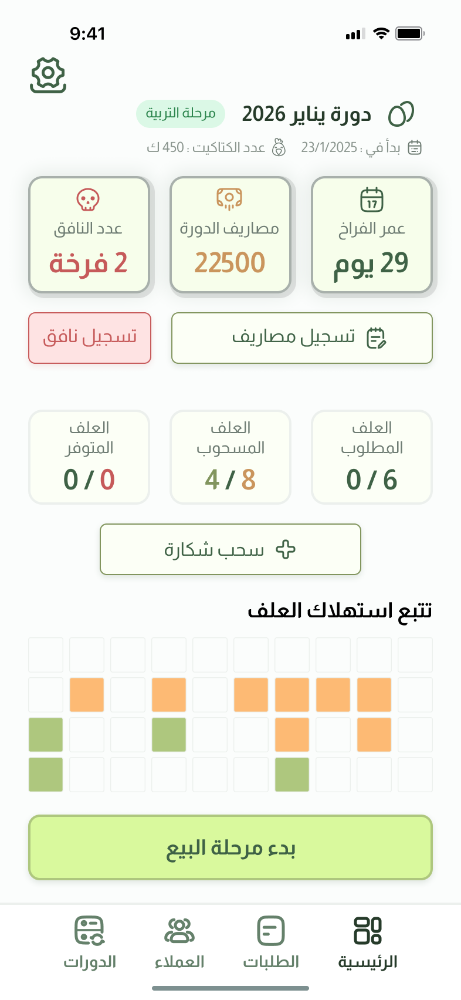
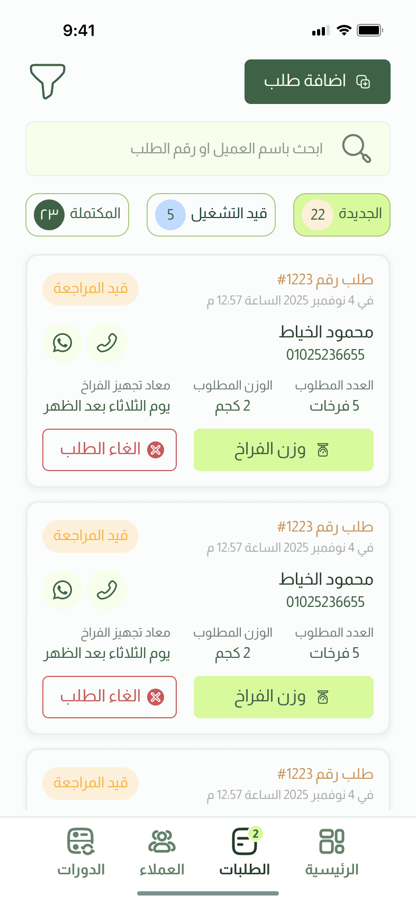
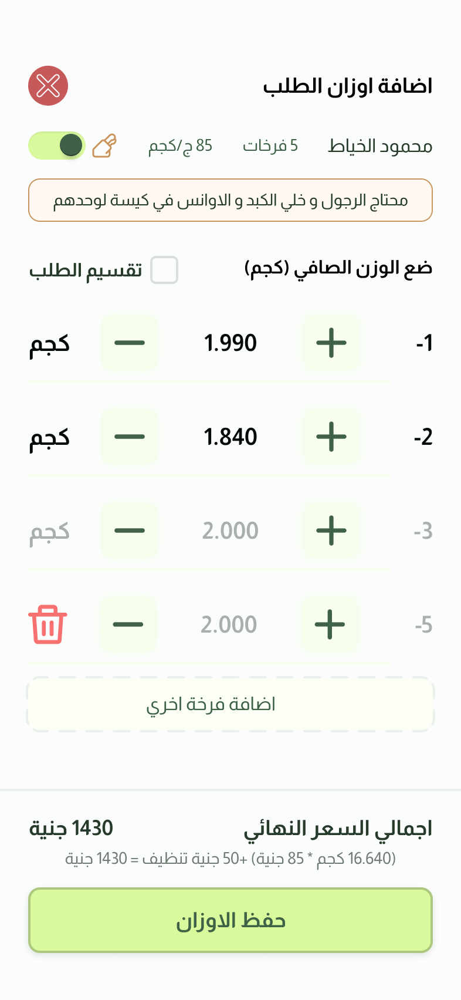
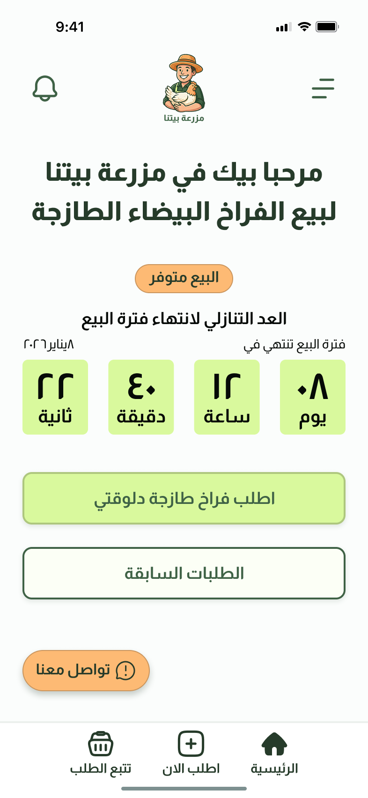
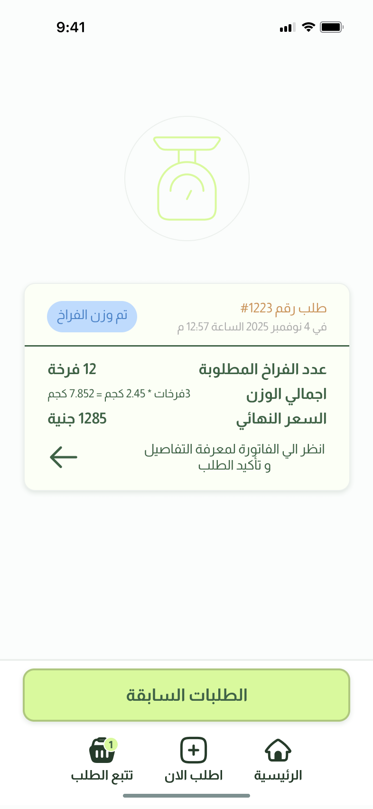
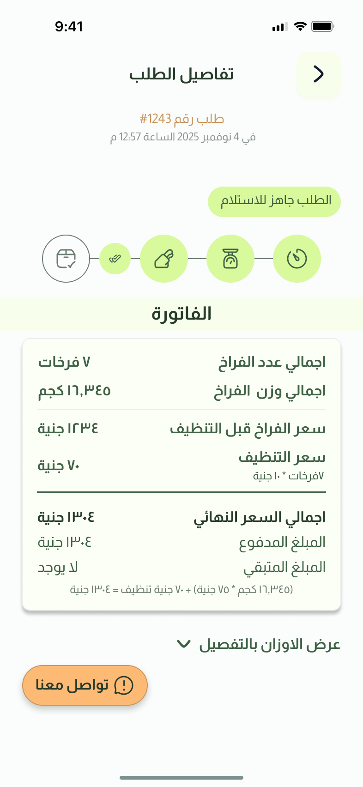

# مزرعة بيتنا — Mazra3et Betna

**A right-to-left Arabic PWA that replaces the paper notebook used to run a small family poultry farm.**

Two apps in one codebase: a **customer app** for ordering, and an **admin app** for running the flock — cycles, feed, weighing, invoices, debts, and accounting.

Built for one real user I know well: my father.

---

## ▶ Try it

**[mazraet-betna-demo.vercel.app](https://mazraet-betna-demo.vercel.app)**

Sign in with either account — the app decides which of the two apps you get from
the number alone (there is no "admin login" screen; see
[Authentication](#authentication-phone-only-no-otp-no-passwords)).

| | Phone | PIN |
|---|---|---|
| **Admin** — cycles, weighing, invoices, accounting | `01000000000` | `123456` |
| **Customer** — ordering and tracking | `01111111111` | — |

The admin account is the one worth your time: it opens on a flock 28 days into a
cycle with the sale running, has orders at every stage waiting to be weighed, and
two finished cycles behind it with real profit and debt figures.

**Or drive it.** Sign in as the customer and place an order; sign in as the admin
and it is there on the orders screen. Weigh it bird by bird, take a payment
against the invoice it computes, hand it over. That loop is the whole app, and
the weighing screen in the middle of it is the screen everything else was built
to support.

> This is a **separate Supabase project** seeded with invented data — a different
> database from the one the farm actually runs on, so nothing here belongs to a
> real customer. Any number you type that isn't listed above will register you as
> a new customer of the demo farm, which is fine; it is what the farm's own
> customers do.

---

## Why this project exists

My father runs a small poultry farm. Everything lived in a paper notebook — who ordered, how many birds, what each one weighed, who paid, who still owes. Orders were taken over the phone and written on whatever was nearby. At the end of a cycle, working out whether it made money meant an evening with a calculator.

So the requirements did not come from a brief. They came from watching him work.

### The three constraints that shaped everything

> **1. He reads no English.**
> Not "prefers Arabic" — cannot read it. So there is **zero English in the interface**: no labels, no placeholders, no error messages, no empty states. Not even a stray `OK`.

> **2. He confuses `2` and `5` in Latin digits.**
> Every number in the app renders in Arabic-Indic digits (`٠١٢٣٤٥٦٧٨٩`) through a single formatter. Nothing renders a raw number anywhere. This is not an aesthetic choice — a misread digit is a wrong invoice.

> **3. He uses the app standing at a scale, with his hands full.**
> Touch targets are ≥ 44px on anything used while weighing. Steps are minimal. And every write gives visible feedback — because when a tap appears to do nothing, he taps again, and that means a duplicate order or a double payment.

The second user is the customer: often elderly, very low digital literacy. That ruled out passwords and one-time codes entirely, which turned out to be the most interesting engineering problem in the project (see [Authentication](#authentication-phone-only-no-otp-no-passwords)).

**Everything below is downstream of these three sentences.**

---

## Design

The Figma file the build was made from. Screen IDs (`A-` admin, `C-` customer) map to
[`docs/10-screen-naming-sheet.md`](docs/10-screen-naming-sheet.md), and the same IDs are
referenced in code comments throughout — so any screen can be traced from design to
component.

<!-- TODO: replace/pair with screenshots of the running app — see Status -->

### Admin — running the flock

| | | |
|:--:|:--:|:--:|
|  |  |  |
| **A-11** — flock age, mortality, cycle costs, and the 40-square feed tracker | **A-50** — orders grouped by stage, searchable by customer or order number | **A-52** — the weighing sheet: one row per bird, live invoice at the foot |

> **A-52 is the most important screen in the project.** It is used standing at a scale
> with one hand, so every control on it is ≥ 44px, the running total is always visible,
> and the work survives the app being backgrounded.

### Customer — ordering and tracking

| | | |
|:--:|:--:|:--:|
|  |  |  |
| **C-10** — sale status and a countdown to the close of the selling window | **C-32** — where the order has reached, in the customer's words | **C-43** — the invoice, with the arithmetic shown rather than just the total |

---

## Stack

| | |
|---|---|
| **Framework** | Next.js 16 (App Router, React 19, Server Components + Server Actions) |
| **Language** | TypeScript — strict, no `any` |
| **Styling** | Tailwind CSS v4 (design tokens via `@theme`, no config file) |
| **Backend** | Supabase — Postgres, Row Level Security, Auth, Realtime |
| **Icons** | Hugeicons, wrapped behind a single `<Icon>` component |
| **Font** | Almarai, self-hosted |
| **Package manager** | pnpm |
| **Hosting** | Vercel (`arn1`) |

There is no REST layer, no client-side data fetching library, and no global state manager. Pages are rendered on the server and read the database directly; writes go through Server Actions. That decision is explained in [Architecture](#architecture).

---

## Architecture

```
Browser (mobile)
     │
     ▼
src/proxy.ts ─────────────► session refresh + route guard
     │                      (role-based: customer app vs admin app)
     ▼
Server Components ────────► read via /lib/queries
     │                      rendered on the server, HTML to the phone
     │
     │  ◄── user taps ──
     ▼
Server Actions ───────────► write via /lib/actions
     │                      revalidatePath() → page rebuilds
     ▼
Supabase / Postgres ──────► Row Level Security is the real boundary
```

**Why server-rendered rather than a client app:** the target device is a mid-range Android phone on Egyptian mobile data. Shipping a bundle that then fetches JSON and renders is the slow path. Here the phone receives finished HTML, and the JavaScript that ships is only what actually needs interactivity — the weighing sheet, the steppers, the bottom sheets.

### Repository layout

```
src/
├─ app/
│  ├─ (customer)/        home · order · tracking · history · notifications
│  ├─ (admin)/           dashboard · cycles · orders · customers · settings
│  ├─ (auth)/            login · register · pin
│  └─ globals.css        design tokens (@theme)
├─ components/
│  ├─ ui/                41 primitives — the design system
│  ├─ admin/ customer/   screen-level components
│  ├─ shared/            used by both apps
│  └─ layout/            shells, headers, LiveRefresh
├─ lib/
│  ├─ actions/           every write (Server Actions)
│  ├─ queries/           every read
│  ├─ calculations/      invoice · cycle P&L · feed
│  ├─ auth/session.ts    sign-in plumbing
│  ├─ supabase/          server · client · middleware
│  └─ format.ts          every number, price, weight, and date
├─ hooks/                9 hooks
└─ proxy.ts              route guard (Next 16 renamed middleware → proxy)

supabase/migrations/     32 migrations · 13 tables · 28 RLS policies · 12 triggers
docs/                    19 documents — research, requirements, decisions
```

Route groups are what make this two apps in one codebase: `(customer)` owns the root, `(admin)` lives under `/admin`, and the guard in `proxy.ts` keeps each role inside its own area.

---

## Engineering notes

The four parts of this project I'd want to talk through.

### Authentication: phone-only, no OTP, no passwords

The customer is often elderly. A password is a barrier; an SMS code is a barrier and a running cost. But Supabase needs a real authenticated user, because **Row Level Security is the entire security model** — and RLS asks `auth.uid()`.

So each account gets a deterministic password derived on the server:

```ts
function derivePassword(scope: "customer" | "admin", phone: string) {
  return createHmac("sha256", process.env.SUPABASE_SECRET_KEY!)
    .update(`${scope}:${phone}`)
    .digest("hex");
}
```

The server can always sign a user in without storing a password, and the user gets a genuine session that RLS can act on. The key never leaves the server, so knowing the admin's phone number does **not** let you derive their credentials, connect to Supabase directly, and bypass the PIN.

The admin adds a PIN on top. Brute force is handled in the database rather than the app — five wrong attempts locks the account for 60 seconds, counted in Postgres so nothing client-side can route around it. That turns a six-digit space from minutes into roughly 138 days.

One detail worth its own line: the role lives in `app_metadata`, never `user_metadata`. Only the service role can write `app_metadata` — `user_metadata` is editable by the user, which would have let anyone promote themselves to admin.

`src/lib/auth/session.ts`

### Security lives in the database, not in the code

28 RLS policies across 13 tables. A customer can read their own orders and their own notifications; the admin can reach only their own farm. If a query in this codebase were wrong, the database would still refuse — the app cannot see rows the policy does not allow, because it queries as the signed-in user.

This also means Server Actions are safe by construction. A Server Action is a real endpoint, so I don't rely on a hidden button: each action re-checks authority, and every write goes through the RLS-bound client. Calling one by hand gets you the same refusal.

21 database functions back this up, and they are deliberately split. RLS helpers (`is_admin`, `owns_order`, `owns_customer`) live in a `private` schema so they are never reachable as API endpoints. The handful in `public` are then granted explicitly rather than by default — `verify_admin_pin`, `set_admin_pin`, and `create_farm` are revoked from `anon` and `authenticated` entirely and executable only by the service role, so the PIN check can never be called from a browser at all.

`supabase/migrations/002_rls.sql`

### Live updates that ship no data to the browser

The admin leaves the app open on the counter all day; a customer watches the order screen waiting for the sale to open. Both need the screen to stay honest without a refresh.

`LiveRefresh` subscribes to changes on four tables and **throws the payload away**. The only thing it takes is the fact that something changed, which becomes `router.refresh()`. Every figure is still computed on the server, by the same query, behind the same RLS — so nothing about how a screen is built moved to the browser. It holds a refresh back for three reasons: a 400ms settling window (related writes cost one re-read), a hidden tab, and an open overlay — the numbers under the weighing sheet must never move while it's being used.

**The bug worth reading the file for.** This worked perfectly in development and silently did nothing in production.

The socket opens before the client finishes reading the session from cookies, so it connects as `anon`. `anon` matches no RLS policy on any of those tables — so it subscribes successfully, reports `SUBSCRIBED`, and is simply never sent anything. It fails without an error.

It worked locally for a reason unrelated to Realtime: React Strict Mode mounts every effect, tears it down, and mounts it again. The second mount happened after the session had loaded, so the second socket was authenticated. Production mounts once, and once was too early.

The fix: read the session and hand the token to the socket *before* subscribing — and hand it over again on every token refresh, since an access token lasts an hour and this app stays open all day. Without that second part it would go live, work beautifully, and quietly stop around lunchtime.

`src/components/layout/LiveRefresh.tsx`

### Arabic is a rendering problem, not a translation problem

Every number in the app passes through `src/lib/format.ts`. Nothing renders a raw number.

**Bidirectional text.** A negative number rendered as `١٩١٥٩-` instead of `-١٩١٥٩`. The minus sign is bidi-neutral, and Arabic-Indic digits are classified as *Arabic* numbers rather than *European* numbers, so the two never bind — inside an RTL paragraph the sign drifts to the far end and reads as a number with a dash after it. Fixed with a Unicode isolate (`U+2066 … U+2069`) around the sign, which pins it without affecting anything around it.

**Pluralization.** Arabic has a dual form, so `${n} فرخات` is wrong for most values of `n`:

| count | form |
|---|---|
| ١ | فرخة |
| ٢ | فرختين |
| ٣–١٠ | فرخات |
| ١١+ | فرخة |

**Input.** Digits display as Arabic-Indic but arithmetic needs Latin, so `toArabicDigits` / `toLatinDigits` sit on both sides of every numeric field.

**Layout.** RTL is not `dir="rtl"` and done. Flex rows mirror automatically, which means JSX source order determines the result — and I got that backwards four times in a single session before adopting `start`/`end` thinking instead of `left`/`right`.

`src/lib/format.ts`

---

## Product decisions

A few places where the interesting choice was a product one, not a technical one:

**Failure feedback is split by severity.** Success and recoverable failures use a toast. But the four critical actions — weighing, payment, cancelling an order, ending a cycle — use a persistent inline error, never a toast. A toast disappears, and a man standing at a scale may simply not have been looking.

**Weighing survives a crash.** The weighing sheet keeps a draft in `localStorage`. Fifty birds weighed one at a time is twenty minutes of work; a backgrounded tab must not cost it.

**The price is stamped when the order is taken.** The customer is quoted a price on the phone, so that is the price they pay — changing the kilo price mid-sale moves only orders taken afterwards, even for orders weighed days later.

**Notifications are written by database triggers,** not by application code. It is therefore not possible to place an order that fails to notify.

**Fourteen pre-loaded, stacked images** for the filling tray on the order screen, cross-faded with `opacity`. Loading on demand meant a visible stall on the counter that matters most.

All ~150 numbered decisions are recorded in [`docs/DECISIONS.md`](docs/DECISIONS.md) with the reasoning behind each.

---

## Running locally

Requires Node 20+, pnpm, and a Supabase project.

```bash
pnpm install
cp .env.example .env.local     # fill in from Supabase → Project Settings → API Keys
```

```
NEXT_PUBLIC_SUPABASE_URL=
NEXT_PUBLIC_SUPABASE_PUBLISHABLE_KEY=
SUPABASE_SECRET_KEY=           # server only — never exposed to the browser
```

### Setting up the database

`supabase/migrations/` is a record of what was applied to the live database over
time, **not a script that replays from empty.** Each migration was applied the day
it was written, so the two data files drifted forward past their own position:
`003_seed.sql` uses columns added in `005`, `007` and `027`, and writes a column
`024` drops. Running the folder in filename order fails on the third file.

Schema replays; data does not. So:

1. Run every migration in filename order, **skipping `003_seed.sql` and
   `014_demo_ended_cycles.sql`**.
2. Then run those two, in that order, against the finished schema — `003` needs
   `settings.sale_closes_at` in place of the dropped `cycle.sale_closes_at`, and a
   seeded `cycle.selling_started_at`. `014` looks the farm up and exits quietly if
   `003` has not run.

If you create the `public` schema yourself rather than using the one Supabase
provides, re-grant it **after** the tables exist — a fresh schema has none of
Supabase's default privileges, and `authenticated` with no table grant fails
every read regardless of RLS:

```sql
grant usage on schema public to anon, authenticated, service_role;
grant all on all tables    in schema public to anon, authenticated, service_role;
grant all on all sequences in schema public to anon, authenticated, service_role;
alter default privileges in schema public grant all on tables    to anon, authenticated, service_role;
alter default privileges in schema public grant all on sequences to anon, authenticated, service_role;
```

Not functions: `verify_admin_pin`, `set_admin_pin` and `create_farm` are
deliberately executable by `service_role` alone, and the migrations grant them
themselves. See `T-76` in [`DECISIONS.md`](docs/DECISIONS.md).

Then:

```bash
pnpm dev            # http://localhost:3000
pnpm build && pnpm start
pnpm lint
```

> Measure navigation speed against `build && start`, never `dev`. Next.js does not prefetch in development, so every navigation looks slower than it is.

---

## Responsive targets

The Figma canvas is 393px, but that is a *design reference*, not a layout width. The app is built fluid from **320px to 430px+**, and the primary target is **360px** — the most common real width among these users' phones.

---

## Documentation

This started as a product exercise, so the research is part of the repository:

| | |
|---|---|
| [`01-project-brief-problem-statement.md`](docs/01-project-brief-problem-statement.md) | The problem |
| [`03-user-personas.md`](docs/03-user-personas.md) | Why the constraints exist |
| [`06-functional-requirements.md`](docs/06-functional-requirements.md) | 35 functional requirements — the spec |
| [`08-user-flows.md`](docs/08-user-flows.md) | End-to-end flows |
| [`15-final-coverage-audit.md`](docs/15-final-coverage-audit.md) | Design-vs-requirements coverage matrix |
| [`17-responsive-guide.md`](docs/17-responsive-guide.md) | Viewport rules |
| [`DECISIONS.md`](docs/DECISIONS.md) | ~150 numbered decisions with reasoning |
| [`PROGRESS.md`](docs/PROGRESS.md) | Build log |

---

## Status

Both apps are feature-complete. `pnpm build` and `pnpm lint` pass clean, with no `TODO` or `FIXME` in `src/`.

**By the numbers:** 15 user-facing routes · 183 components · 13 tables · 32 migrations · 28 RLS policies · 12 triggers · 35 functional requirements.

### Not done yet

| | |
|---|---|
| **Screenshots of the running app** | The Design section above shows the Figma frames it was built from, not the built screens. Pairing each frame with the shipped result is the next thing to add |
| **Service Worker** | The app installs to the home screen, but does not yet work offline. Manifest, icons, and install prompt are done — the offline layer is not. In hindsight this should have come first, since offline was a reason to build a PWA at all |
| **FR-16 — editing a weighed order** | Deliberately deferred; the `تعديل` button in the invoice sheet is inert until it lands |
| **Social links in the contact sheet** | No field in the schema to hold them yet |
| **Loss visualisation** | A cycle that lost 3,000 EGP and a cycle that broke even currently look the same on the comparison chart |
| **One farm per deployment** | The schema, RLS and both login paths are multi-tenant; self-registration is not — it attaches a new customer to `farm limit 1`, because nothing tells it which farm the visitor came for. Real multi-tenancy needs a farm-scoped entry point (a subdomain, a `/f/<slug>` path, or an invite link) — `D-76` |

### Deliberately not built

Temperature index (`FR-6`) and a "notify me when the sale opens" button — both cut after talking to the user rather than left undone.

---

## A note on how this was built

I'm a product designer. I did the user research, the Figma file, the requirements, and the implementation, working alongside Claude Code as a pair. The decision log in [`docs/DECISIONS.md`](docs/DECISIONS.md) records the reasoning behind every architectural and product choice as it was made — it's the honest record of how the thing was actually reasoned about.

---

**Khaled** · [khaledsproo@gmail.com](mailto:khaledsproo@gmail.com)
